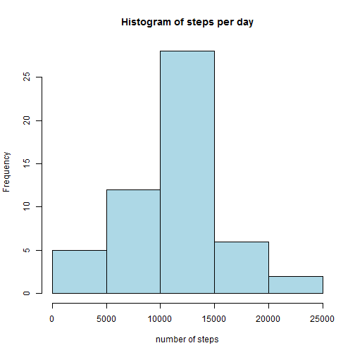
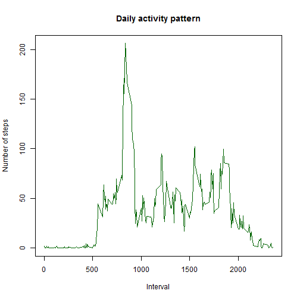
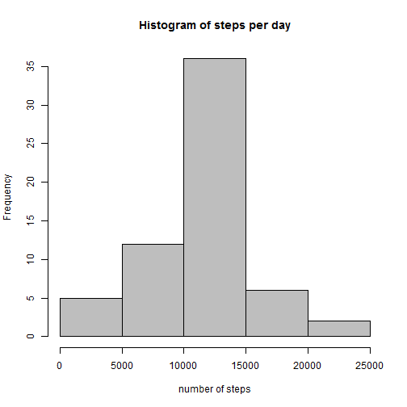
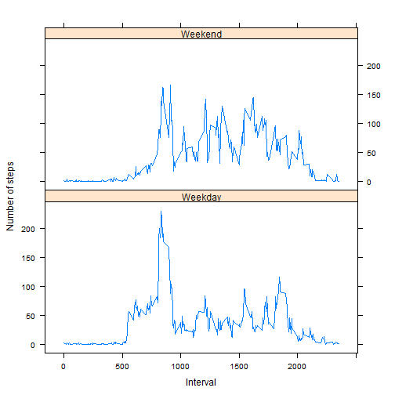

In this assignment we need to process activity data.

##Loading and preprocessing the data

The first thing is to load the data. I store it into a variable called `set`. 


```r
set <- read.csv("activity.csv")
head(set)
```

```
##   steps       date interval
## 1    NA 2012-10-01        0
## 2    NA 2012-10-01        5
## 3    NA 2012-10-01       10
## 4    NA 2012-10-01       15
## 5    NA 2012-10-01       20
## 6    NA 2012-10-01       25
```

##What is mean total number of steps taken per day?

Calculating the total number of steps taken per day using the tapply function. To avoid na's I used `na.rm = TRUE` parameter.


```r
daySteps <- tapply(set$steps, set$date, sum)
```

Making a histogram.


```r
hist(daySteps, col = "light blue", main = paste("Histogram of" , "steps per day"), xlab = "number of steps")
```

 

Calculating the mean and the median of the total number of steps.


```r
mean(daySteps, na.rm = TRUE)
```

```
## [1] 10766.19
```

```r
median(daySteps, na.rm = TRUE)
```

```
## [1] 10765
```

##What is the average daily activity pattern?

Getting average number of steps.


```r
AvSteps <- aggregate(steps ~ interval, set, mean)
```

Making a time series plot of the 5-minute interval.


```r
plot(AvSteps$interval, AvSteps$steps, type = 'l', col = "dark green", main = "Daily activity pattern", xlab = "Interval", ylab = "Number of steps" )
```

 

The maximim number of steps is in the 835 interval.


```r
subset(AvSteps, steps == max(AvSteps$steps))
```

```
##     interval    steps
## 104      835 206.1698
```

##Imputing missing values
The only column which has na's is `steps`. So there are 2304 rows with unknown values.


```r
summary(set)
```

```
##      steps                date          interval     
##  Min.   :  0.00   2012-10-01:  288   Min.   :   0.0  
##  1st Qu.:  0.00   2012-10-02:  288   1st Qu.: 588.8  
##  Median :  0.00   2012-10-03:  288   Median :1177.5  
##  Mean   : 37.38   2012-10-04:  288   Mean   :1177.5  
##  3rd Qu.: 12.00   2012-10-05:  288   3rd Qu.:1766.2  
##  Max.   :806.00   2012-10-06:  288   Max.   :2355.0  
##  NA's   :2304     (Other)   :15840
```

Replacing na's with the mean for corresponding day using the `AvSteps`.


```r
for (i in 1:nrow(set)){
        if (is.na(set$steps[i])){
                val <- set$interval[i]
                id <- which(AvSteps$interval == val)
                val <- AvSteps$steps[id]
                set$steps[i] <- val
                }
        }
```

Making a histogram.


```r
hist_set <- tapply(set$steps, set$date, sum)
hist(hist_set, col = "gray", main = paste("Histogram of" , "steps per day"), xlab = "number of steps")
```

 

Calculating the mean and the median. There is no change in mean value comparing to original dataset and unsignificant change in median.


```r
mean(hist_set)
```

```
## [1] 10766.19
```

```r
median(hist_set)
```

```
## [1] 10766.19
```

##Are there differences in activity patterns between weekdays and weekends?

Creating a new factor variable to indicate type of the day


```r
Sys.setlocale("LC_TIME", "English")
```

```
## [1] "English_United States.1252"
```

```r
set$date <- as.Date(strptime(set$date, format="%Y-%m-%d"))
days <- weekdays(set$date)
set$day_type <- ifelse(days == "Saturday" | days == "Sunday", "Weekend","Weekday")
AvSteps <- aggregate(set$steps, by = list(set$interval, set$day_type),mean)
names(AvSteps) <- c("interval", "day_type", "steps")
```

Making a panel plot containing a time series plot of the 5-minute interval.


```r
library(lattice)
xyplot(steps ~ interval | day_type, AvSteps, type = "l", layout = c(1, 2), xlab = "Interval", ylab = "Number of steps")
```

 


